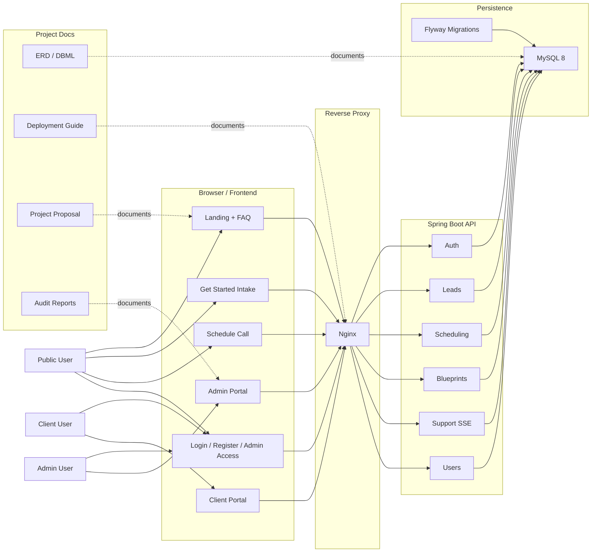

# Nexoria Architecture Diagram

## Mermaid Source

## Notes

- Public traffic flows into the landing page, intake flow, scheduling flow, and authentication pages.
- Admin traffic uses the admin portal for leads, calls, schedule settings, users, blueprints, and support.
- Client traffic uses the client portal for approved blueprint views, next steps, results, scheduled calls, and support.
- The backend persists to MySQL and uses Flyway as the schema source of truth.
