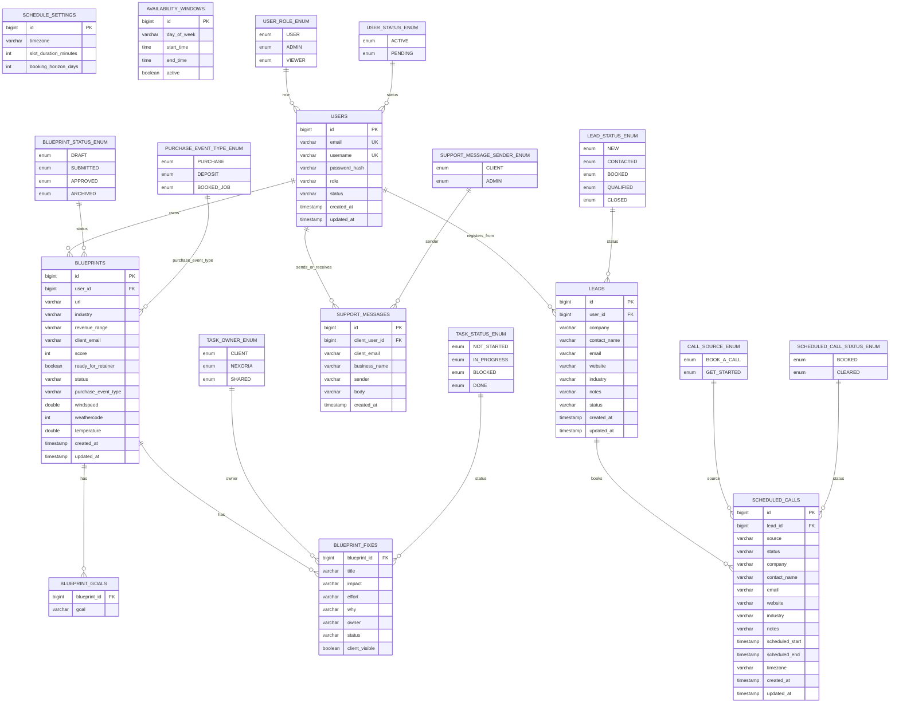

# Nexoria ERD Diagram

Updated: April 26, 2026  
Source of truth: `backend/src/main/resources/db/migration/` and `infra/docs/erd.dbml`

## Application-Level Links

Some product relationships are enforced by service logic rather than database foreign keys:

- `blueprints.client_email` matches `users.email` for approved client-portal blueprint access.
- `scheduled_calls.email` matches `users.email` for the client scheduled-call card.
- `support_messages.client_email` groups admin/client support threads.
- Client registration is allowed only when a matching lead email has `BOOKED` or `CLOSED` status.
- Lead deletion clears `scheduled_calls.lead_id` before removing the lead.
- User deletion clears `leads.user_id` and `support_messages.client_user_id` before removing the user.
- The enum boxes in the Mermaid diagram are logical type nodes so the Markdown view matches DBML Live Preview. They are not physical lookup tables in MySQL.

## Compatibility Notes

- Enum values are persisted as `VARCHAR(50)` in the Flyway schema.
- `score`, `ready_for_retainer`, `windspeed`, `weathercode`, and `temperature` remain in the database for compatibility, but they are no longer part of the active product flow.
- `schedule_settings` and `availability_windows` are operational scheduling tables. They do not currently require foreign keys to user accounts.
